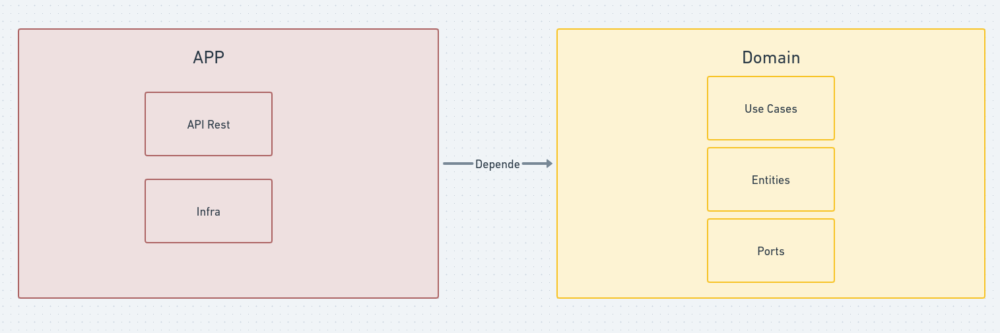

## Autorizador de transações

Este projeto visa simular um autorizador de transações financeiras, onde é possível realizar transações crédito.

### Tecnologias utilizadas
- Gradle multi-modules;
- Spring Web, JDBC Client;
- PostgreSQL;

### Execução do projeto

Os seguintes pré-requisitos são necessários para a execução do projeto:

- [Java 22](https://www.oracle.com/br/java/technologies/downloads/)
- [Docker](https://docs.docker.com/get-docker/)
- [K6](https://k6.io/open-source/) - Opcional, para execução de testes de carga

Após instalado os pré-requisitos, execute o projeto a partir da classe principal do projeto ***app/src/main/java/com.transactions.app/Application.java***.
A aplicação será executada na porta 8080 e rodará os scripts de seeding para popular o banco de dados que será criado no container do Docker.

A aplicação conta com o Swagger para documentação dos endpoints, que pode ser acessado através do link http://localhost:8080/.

O seguinte endpoint estará disponível para realizar transações:

- POST /transactions/authorize

```json
Body:

{
  "accountId": "ee73630f-31f9-4105-b433-537fd3d79e41", // Id da conta
  "merchantName": "Merchant Teste",                    // Nome do estabelecimento
  "mcc": "5412",                                       // Código de atuação do estabelecimento
  "amountCents": 1000                                  // Valor da transação em centavos 
}
```

O motivo da escolha do valor da transação ser em centavos é para evitar problemas com [arredondamentos de valores decimais](https://blog.codeminer42.com/be-cool-dont-use-float-double-for-storing-monetary-values/).

### Estrutura do projeto



O projeto foi dividido em 2 módulos seguindo o padrão de arquitetura hexagonal/clean architecture:
- **app**: Módulo da aplicação, responsável por orquestrar as chamadas aos serviços e regras de negócio por meio de uma API Rest.
- **domain**: Módulo que contém as entidades e regras de negócio da aplicação. O módulo não depende de nenhum outro módulo tendo dependêcia somente com a [especificação de injeção de dependêcias do Java](https://jakarta.ee/specifications/platform/10/apidocs/jakarta/inject/package-summary.html), protegendo o domínio de tecnologias específicas de frameworks como o Spring, sendo assim portátil para outros frameworks caso seja necessário.

## L4. Transações simultâneas

Para solucionar o problema de concorrência, foi utilizado o conceito de lock otimista, onde é verificado se a conta foi atualizada por outra transação
por meio de um campo de versão. Caso a versão da conta seja diferente da versão que foi lida, a transação é rejeitada. Deixando para o cliente realizar
uma nova tentativa de transação.

Foi implementado no DbAccountRepository essa verificação:

```sql
UPDATE balanceaccount SET balancecents = ?, lockversion = ? WHERE id = ? AND lockversion = ?
```
Caso nenhum registro seja atualizado, a transação é rejeitada.

Para simular transações simultâneas, foi criado um script de teste de carga utilizando o K6, que realiza 10 requisições simultâneas ao endpoint de
autorização de transações. O script pode ser encontrado na raiz do projeto no arquivo ***load-test.js*** que pode ser executado com o comando:

```shell
$ k6 run load-test.js
```

Somente uma transação será autorizada, as demais serão rejeitadas.

Um ponto de melhoria seria a implementação de um mecanismo de retry para as transações rejeitadas, para que o cliente não precise realizar uma nova
tentativa manual.

Outro ponto de melhoria seria implementar o conceito de idempotência para evitar transações duplicadas.


